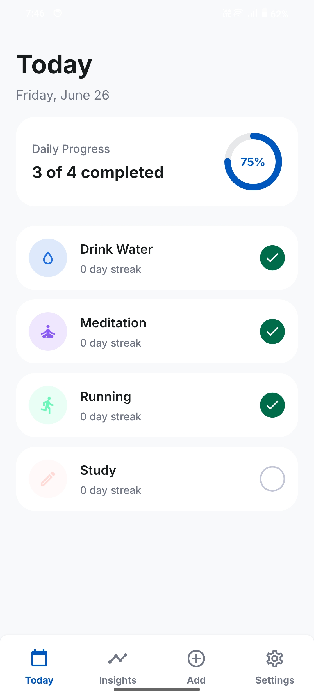
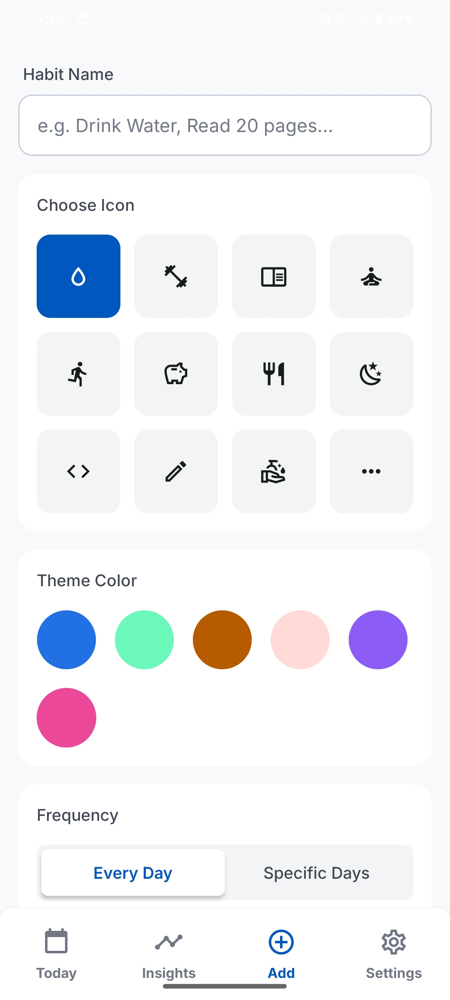
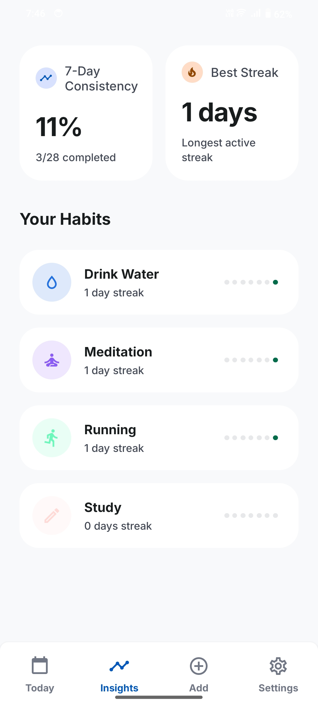
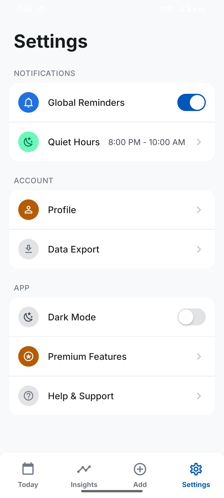

# Stack - Small wins, stacked daily

Stack is a minimalist habit tracker built with React Native. Create daily habits, check them off with a tap, and watch your streaks grow over time. Includes local data persistence, daily reminders, and visual progress tracking — all with a clean, distraction-free UI.

## Screenshots

<p align="center">
  
  
  
  
</p>

## Get started

1. Install dependencies

   ```bash
   npm install
   ```

2. Start the app

   ```bash
   npx expo start
   ```
